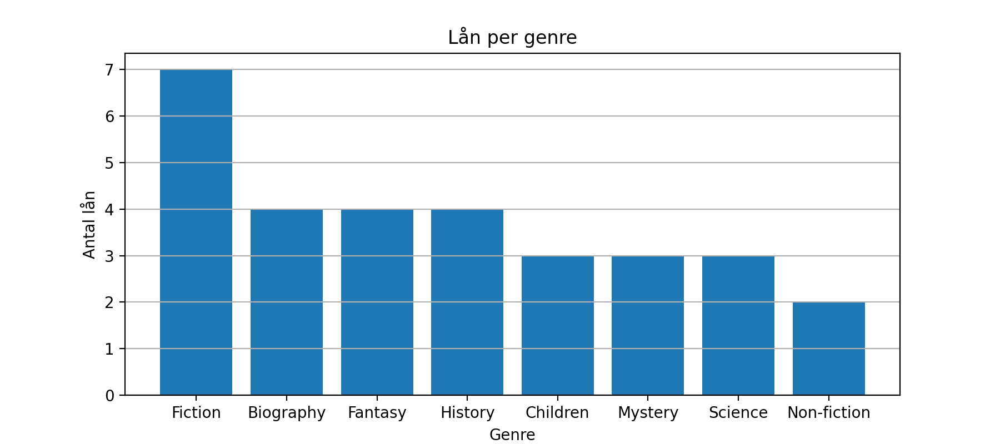
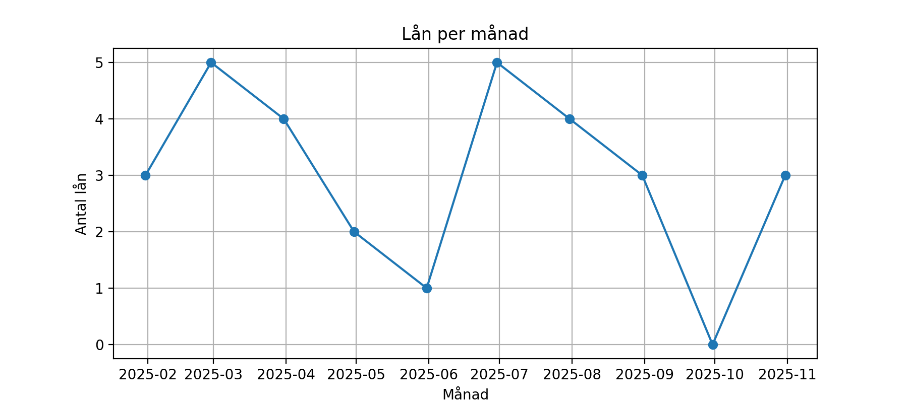
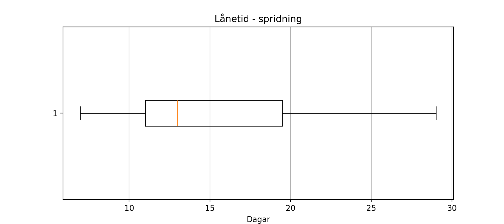

# EDA - Biblioteksutlåning

## Rapport

### Nyckeltal (från notebooken, efter lätt städning)
- **Totalt antal lån:** 30
- **Genomsnittlig lånetid:** 15.6 dagar
- **Antal lån på övertid** 50%


### Figurer





### Tabeller (exporterade)
- `data/pivot_branch_x_genre.csv`

### Slutsatser baserat på akutell data 
- **Topp-genrer:** 1. Fiction (7), 2. Biography (4), 3. Fantasy (4).
- **Topp-filialer:** 1. Lund Central (8), 2. Stockholm Söder (6), 3. Malmö City (6).
- **Säsongstopp:** 2025-02 och 2025-06 med **5** unika lån/mån
- **Policy-notering** Övertidsandelen ligger på **50%** - följ upp med påminnelser.

## Miljö
- **Python:** 3.13.7
- **Paket:** `Pandas`, `Matplotlib` (se `requirements.txt`)

## Kom igång

```bash
# klona projektet 
git clone https://github.com/MagdalenaPersson/EDA---Biblioteket.git
cd library-eda

# Skapa och aktivera virtuell miljö
python -m venv .venv
# Windows PowerShell
.venv\Scripts\Activate
# macOS/Linux
# source .venv/bin/activate

# installera beroenden
python -m pip install -r requirements.txt

```